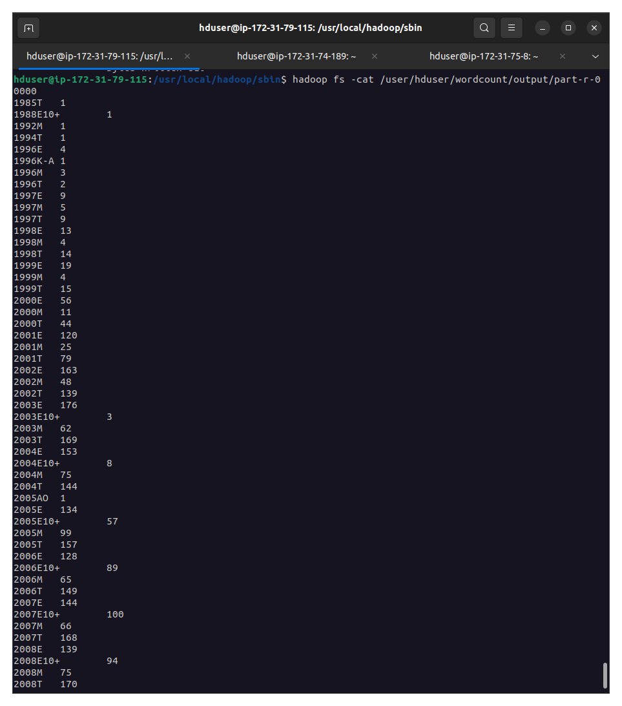

Giorgi Samushia, Andrew Nelson, Tyler Najara

CMPT 364 Final Project

Rating Count for Video Games Using Hadoop MapReduce

The dataset was obtained from Kaggle:

https://www.kaggle.com/datasets/rush4ratio/video-game-sales-with-ratings

The games-list.csv file was cleaned and separated into five different files, each corresponding to a distinct rating.

The initial data was modified using the python code included. Commas were removed from the data values, and the csv was stripped of null values. The year values were also converted to int so they looked nicer. 

The new data was put in the data.csv file.

Upon startup of a new cluster and declaration of master and worker machines, data.csv and RatingCount.java were copied to the master machine using scp. 

The following lines were executed in order to run mapreduce on the data.

    start-dfs.sh
    start-yarn.sh
    cd $HADOOP_INSTALL/sbin
    mr-jobhistory-daemon.sh start historyserver

    hadoop com.sun.tools.javac.Main RatingCount.java
    jar cf rc.jar RatingCount*.class

    sudo cp /home/ubuntu/RatingCount.java ./
    sudo cp /home/ubuntu/data.csv ./

    hadoop fs -mkdir /user
    hadoop fs -mkdir /user/hduser
    hadoop fs -mkdir /user/hduser/ratingcount
    hadoop fs -mkdir /user/hduser/ratingcount/input

    hadoop fs -put data.csv /user/hduser/ratingcount/input/

    hadoop jar rc.jar RatingCount /user/hduser/ratingcount/input /user/hduser/ratingcount/output   

    hadoop fs -cat /user/hduser/wordcount/output part-r-00000

